## 六、拓展任务

---

---

## 目录

- [6.1 拓展1：共享单车状态图最短路径](#61-拓展-1共享单车状态图最短路径)
- [6.2 拓展2：自定义数据集与对抗样例](#62-拓展-2自定义数据集与对抗样例)
- [6.3 拓展3：tarjan算法求割点与桥](#63-拓展-3tarjan-算法求割点与桥)
- [6.4 拓展4：图形化界面](#64-拓展-4图形化界面)

### 6.1 拓展 1：共享单车（状态图最短路径）

- **时间复杂度**：**O(K·(V+E)·log(K·V))**，K ≤ 10 时约为普通 Dijkstra 的 10 倍常数
- **空间复杂度**：O(K·V + E)（`dist` 和 `prev` 各 O(K·V)，优先队列 O(K·V)，邻接边缓存 O(E)）
- **实现要点**：

#### 图的方向性

本算法**同时支持无向图和有向图**，对于无向图，`GetAdjacentEdges` 返回的邻接边已覆盖双向

#### 调用接口

| 方法 | 说明 |
|------|------|
| `GetAdjacentEdges` | 获取当前顶点的所有 `open` 邻接边，用于生成两种转移 |
| `ExistVertex` | 校验起终点是否存在（入口处检查） |

#### 算法选型：状态空间 Dijkstra 而非物理分层图

分层图最直观的实现是**物理构建 K+1 层图**——将原图复制 K+1 份，层间用加速边连接，然后跑标准 Dijkstra。但在本项目中选择**状态空间搜索**：

1. **避免显式构建分层图的内存开销**：物理分层图需要创建 `(K+1)×V` 个顶点和 `(2K+1)×E` 条边的完整邻接表，而状态空间方案通过保留状态隐式分层，内存友好

2. **懒惰分配与缓存友好**：`dist` 和 `prev` 使用 `unordered_map<State, ...>`，只有松弛成功时才插入新状态。对于校园图实际路径通常不长的特点，很多高券数层根本不会被访问，避免了物理分层图中预分配全部层的浪费


#### 状态编码与哈希

状态定义为 `pair<string, int>`（地点 ID + 已用券数）。标准库没有为 `pair` 提供默认哈希，所以让AI帮我自定义了一个 `StateHash`：

```cpp
struct StateHash {
    size_t operator()(const State &s) const {
        size_t h1 = std::hash<std::string>{}(s.first);
        size_t h2 = std::hash<int>{}(s.second);
        return h1 ^ (h2 + 0x9e3779b9 + (h1 << 6) + (h1 >> 2));
    }
};
```

核心是经典的 `hash_combine` 手法：`0x9e3779b9` 是黄金分割比的 32 位定点表示，`h1 << 6` 与 `h1 >> 2` 将 `h1` 的高低位与 `h2` 充分搅拌，使得不同状态（如同一地点的不同券数、不同地点的同一券数）的哈希值均匀分布

#### 两种转移与加速代价的整数计算

对每条邻边 `(cur_node, neighbor)`，步行时间 `w`：

```cpp
// 转移 A：普通通行（不消耗券）
State ns_normal = {neighbor, cur_tickets};
int nc_normal = cur_cost + w;

// 转移 B：加速通行（消耗 1 张券）
if (cur_tickets < K) {
    int fast_cost = (w + 2) / 3;     // ceil(w/3)，整数无浮点误差
    State ns_fast = {neighbor, cur_tickets + 1};
    int nc_fast = cur_cost + fast_cost;
}
```

加速代价 `ceil(w/3)` 采用取上整除 `(w + 2) / 3`，避免浮点数精度问题，且大大提升效率

#### 懒惰删除

弹出堆顶时通过 `if (cur_cost != dist[cur_state]) continue;` 判断条目是否过期，与先前代码风格一致

#### 前驱记录与路径回溯

这是本算法与普通 Dijkstra 路径回溯的**最大差异**：前驱不仅要记录"从哪个地点来"，还要记录"当时用了多少券"以及"这条边是否用了券"。

```cpp
struct Prev {
    State prev;         // 前一个状态（含地点和券数）
    std::string from;   // 边起点
    std::string to;     // 边终点
    bool fast;          // 是否使用了加速券
};
```

回溯流程：
1. 从终点状态出发，沿 `prev` 链反向追踪至起点状态 `(from_id, 0)`。
2. 每一步收集 `p.to` 进入逆序路径，若 `p.fast == true` 则将该边加入 `fast_edges`。
3. 最后翻转路径得到正向序列。

这种前驱设计使得路径和用券记录在一次回溯中同时生成，无需额外的后处理分析。

#### 复杂度分析

- 状态空间大小：`(K+1)×V`，K ≤ 10 时为 `≤ 11V`。
- 每条边产生两种转移，每个状态最多被处理一次，总松弛次数 `O(K×E)`。
- 优先队列每次操作 `O(log(K·V))`，总时间 **O(K·(V+E)·log(K·V))**。

对于校园图 V=500、E=800、K=5 的典型场景，状态数约 3000，松弛次数约 8000，堆操作约 3000 次，毫秒级完成。即使 K=10、V=10000，状态数 11 万，也仅为普通 Dijkstra 的 11 倍常数，完全满足交互式查询需求。

#### 算法实现步骤

1. **参数校验**：检查起终点是否存在，K 是否在 `[0, 10]` 范围内。
2. **初始化**：`dist[{from_id, 0}] = 0`，将该状态推入小顶堆。
3. **Dijkstra 主循环**：
   - 弹出堆顶，懒惰删除过时条目。
   - 遍历当前顶点的所有 `open` 邻边，对每条边生成两种转移：
     - 普通转移：代价 +`w`，券数不变。
     - 加速转移（若券未用完）：代价 +`ceil(w/3)`，券数 +1。
   - 对每个转移，若新代价更优则更新 `dist` 和 `prev`，推入堆。
4. **结果提取**：遍历所有 `t = 0..K` 的 `(to_id, t)` 状态，取 `dist` 最小者。若无任何状态可达，返回 `reachable = false`。
5. **路径回溯**：从最优终点状态沿 `prev` 链反向追踪至起点，翻转得到正向路径，途中收集用券边。
6. **返回**：填充 `KPathResult`（总耗时、实际用券数、路径、用券边列表、可达标志）。


### 6.2 拓展 2：自定义数据集与对抗样例

详情请见[创新数据集.md](创新数据集.md)

### 6.3 拓展 3：Tarjan 算法求割点与桥

- **时间复杂度**：**O(V+E)**，一次显式栈 DFS 同时找出全部割点与桥
- **空间复杂度**：O(V+E)（`dfn`、`low`、`is_art`、`child_cnt` 各 O(V)，邻居缓存 O(E)，显式栈最坏 O(V)）
- **实现要点**：

#### 图的方向性

与暴力法一致，本算法**仅支持无向图**

#### 调用接口

| 方法 | 说明 |
|------|------|
| `IsDirected` | `方向性处理` |
| `AllPlaceIds` | 获取全部顶点，建立字符串 ID 到整数索引的双向映射 |
| `GetAdjacentEdges` | 获取每个顶点的 `open` 邻接边，预缓存为整数索引邻接表 |

#### Tarjan 算法原理简述

Tarjan 算法是图论中求解割点与桥的经典线性算法，核心是基于深度优先搜索（DFS）的生成树结构。为每个顶点维护两个时间戳：

- **`dfn[u]`**（发现时间）：顶点 u 在 DFS 中首次被访问的顺序编号
- **`low[u]`**（最早回溯值）：从 u 出发，通过树边或回边所能到达的 DFS 树中最早祖先的 `dfn` 值

在 DFS 回溯阶段进行判定：

- **割点（非根）**：若 u 的某个子女 v 满足 `low[v] >= dfn[u]`，说明 v 及其后代无法绕过 u 抵达 u 的祖先。移除 u 后 v 子树与原图断开，故 u 是割点
- **割点（根节点）**：若根在 DFS 树中有 **≥2 个子女**，则根是割点。因为去掉根后，各子女子树彼此独立，无法互达
- **桥**：对于树边 `(parent → child)`，若 `low[child] > dfn[parent]`，说明 child 子树无法通过任何回边绕过 parent 到达 parent 及以上，该边即为桥


#### 核心设计抉择：字符串 ID 与整数索引的映射

Tarjan 算法要求以整数索引操作数组 `dfn[]`、`low[]` 等，而本项目图结构统一使用字符串 `place_id`，这无可避免，此处被迫建立一次 `id_to_idx` 映射表：

```cpp
std::unordered_map<std::string, int> id_to_idx;
for (int i = 0; i < n; ++i)
    id_to_idx[vertices[i]] = i;
```

此映射仅在算法初始化时创建一次，后续邻接遍历全部使用整数索引，避免DFS中反复进行字符串哈希查找

#### 递归转显式栈迭代

对于 V 可达万级的大规模图，递归 DFS 有栈溢出风险，本项目采用**显式栈帧结构体**模拟递归过程：

```cpp
struct Frame {
    int u;       // 当前节点索引
    int parent;  // DFS 树中的父节点索引（-1 表示根）
    int idx;     // 下次要处理的邻边在缓存列表中的下标
};
std::vector<Frame> stack;
```

每个栈帧维护三个关键信息：
- `u`：当前正在访问的顶点
- `parent`：在 DFS 树中的父节点，用于跳过无向图回边和回溯时更新父节点的 `low`
- `idx`：下一次要处理的邻边位置。这是模拟递归“返回后继续执行下一条邻边”的关键——当从子节点返回时，栈顶仍是父节点的帧，`idx` 记录了上次处理到哪条边，继续往下即可

**与递归的对应关系**：
| 递归操作 | 迭代模拟 |
|----------|----------|
| 进入递归 `dfs(v, u)` | `stack.push_back({v, u, 0})` |
| 函数体首次执行 | `top.idx == 0` 时设置 `dfn[u] = low[u] = ++timer` |
| 遍历邻接边 | `for` 循环变为每次从 `neighbors[u][top.idx]` 取一条，`idx++` |
| 递归调用子节点 | 遇到未访问邻居时直接 `push_back`，下一轮循环处理子节点 |
| 回溯 | 子节点邻边全部处理完毕后 `pop_back`，此时栈顶回到父节点，继续其未完成的邻边遍历 |
| 函数返回 | `pop_back` 后，用子节点的 `low` 更新父节点的 `low` 并进行割点/桥判定 |

**判定时机**：在一个顶点 `u` 的所有邻边处理完毕、即将被弹出栈时（即 `top.idx == neighbors[u].size()` 分支），进行回溯更新和判定。此时 `u` 的所有子女已全部处理完毕，`low[u]` 已经是最终值，可以安全地将信息回传给父节点 `parent` 并检查 `low[u] >= dfn[parent]`（割点）和 `low[u] > dfn[parent]`（桥）。

#### 根节点判定的修正

递归版 Tarjan 中，根节点是否割点由其 DFS 调用结束后的子女数量判定。迭代版由于无“函数返回后”的概念，需要在每棵 DFS 树生成完成后单独处理。

具体做法：在从根节点 `start` 出发的 `while` 循环结束后，检查 `child_cnt[start]`。若 `>= 2`，则 `start` 是割点。`child_cnt` 在每次发现树边（即 `dfn[v] == 0` 的邻接点）时递增，准确统计了根节点在 DFS 树中的直接子女数。

**割点判定的额外细节**：在回溯判定非根割点时，显式检查当前父节点 `parent` 是否是根（通过 `stack.back().parent == -1` 判断）。若 `parent` 是根，则跳过 `low[u] >= dfn[parent]` 判定，因为根的割点条件完全不同，避免误判。

#### 邻居缓存预处理

为减少 DFS 中对 `GetAdjacentEdges` 的重复调用和字符串操作，算法在初始化阶段即构建邻接表：

```cpp
std::vector<std::vector<int>> neighbors(n);
for (int i = 0; i < n; ++i) {
    auto edges = graph.GetAdjacentEdges(vertices[i], true);
    for (const auto &e : edges) {
        std::string nb = (e.from_id == vertices[i]) ? e.to_id : e.from_id;
        auto it = id_to_idx.find(nb);
        if (it != id_to_idx.end())
            neighbors[i].push_back(it->second);
    }
}
```

这使 DFS 主循环中的邻边访问退化为纯整数数组操作，大幅降低常数因子。

#### 性能对比实测

| 测试用例 | 朴素枚举 (naive) | Tarjan (tarjan) | 加速比 |
|----------|------------------|-----------------|--------|
| **grid**（大网格稀疏图） | 1.81 s | 57 ms | **~33x** |
| **k80**（80 点完全图） | 1.82 s | 53 ms | **~37x** |

- **grid** 为大规模稀疏图，暴力法 O((V+E)²) 在 V≈10000 时达到秒级，Tarjan 的 O(V+E) 仅需 63ms。
- **k80** 为小规模稠密图（V=80, E=3160），暴力法关键边部分需执行 3160 次 BFS 而陷入秒级，Tarjan 的线性特性使时间稳定在 56ms，几乎不随密度增长。

这组数据直接展示了“复杂度从平方降到线性”的质变效果，是课程报告中最具说服力的算法优化案例。

#### 算法实现步骤

1. **有向性检查**：若图为有向图，抛出异常。
2. **建立索引映射**：通过 `AllPlaceIds()` 获取全部顶点，建立 `id_to_idx` 字符串→整数映射。
3. **邻居缓存预处理**：对每个顶点调用 `GetAdjacentEdges`，将其 `open` 邻居转换为整数索引存入 `neighbors` 列表。
4. **初始化 Tarjan 数据结构**：`dfn`、`low`、`is_art`、`child_cnt` 均为 O(V) 大小，`timer = 0`。
5. **对每个未访问顶点启动 DFS**：
   - 压入初始帧 `(start, -1, 0)`。
   - 循环处理栈顶帧：
     - 若 `idx == 0`，设置 `dfn[u] = low[u] = ++timer`。
     - 若还有未处理邻边，取出 `v = neighbors[u][idx++]`。若 `v == parent` 跳过；若 `dfn[v] == 0`（树边），增加 `child_cnt[u]` 并压入子节点帧；否则（回边），更新 `low[u] = min(low[u], dfn[v])`。
     - 若所有邻边处理完毕，弹出帧。若非根节点，更新 `low[parent] = min(low[parent], low[u])`；在 `parent` 非根前提下若 `low[u] >= dfn[parent]`，标记 `parent` 为割点；若 `low[u] > dfn[parent]`，收集该边为桥。
   - 根节点特殊判定：若 `child_cnt[start] >= 2`，标记 `start` 为割点。
6. **整理结果**：遍历 `is_art` 收集割点，桥列表直接赋值。返回 `CriticalResult`。
---


### 6.4 拓展 4：图形化界面

> **协作方式**：我编写了架构设计大纲，明确三层架构、API 设计、交互流程。AI（DeepSeek V4 Pro，通过 Claude Code）根据大纲撰写具体 prompt 并完成 `bridge.py` 和 `index.html` 的全部代码。我负责需求定义、功能验收和调试反馈。

#### 技术栈

采用**浏览器 + Flask 中间层**架构，C++ 代码零修改：

| 层 | 技术 | 说明 |
|----|------|------|
| 前端 | HTML + CSS + Leaflet.js | 地图渲染、节点拖拽、tooltip、按钮交互 |
| 中间层 | Python Flask | HTTP API，将用户操作翻译为 CLI 命令发给 exe |
| 后端 | CampusNavigation.exe | 不修改任何 C++ 代码 |

浏览器通过 `fetch` 调用 Flask API（`/api/shortest`、`/api/mst`、`/api/critical` 等），Flask 用 `subprocess.run` 启动 exe 并灌入完整命令序列（LOAD + 算法 + QUIT），解析 stdout 返回 JSON，前端用 Leaflet 渲染。

#### 必须展示项

| 项目 | 实现 |
|------|------|
| 节点位置 | 网格自动布局 + 可拖拽调整 |
| open/closed 边区分 | 绿色实线 / 红色虚线 |
| 最短路径高亮 | SHORTEST（蓝粗线）/ TIMED_SHORTEST / MUST_PASS（粉色）/ SHORTEST_K（黄色虚线标记用券边） |
| MST | 橙色线标出生成树边 |
| 关键节点/边 | CRITICAL 按钮（内置 Tarjan O(V+E)）— 金色外圈割点 + 紫色虚线桥 |
| COMPONENTS | 弹窗显示连通分量数与规模 |
| 非法数据 | 深红虚线标出，红色警告横幅，算法按钮自动禁用 |

#### 亮点

1. **悬停 tooltip**：显示 `place_id`、`display_name`、`category`、开放时间
2. **类别着色**：6 种 category 各不同颜色（Teaching=蓝, Dining=橙, Dormitory=绿, Sports=红, Medical=黄, Other=灰）
3. **拖拽布局**：Leaflet `draggable: true`，可手动调整节点位置
4. **全量预生成**：启动时一次性生成全部 29 个数据集的图数据到 `graph_data.js`，前端切数据集零延迟
5. **前端校验**：TIMED 时间格式、MUST_PASS 必经点格式、SHORTEST_K 的 K 值范围均有即时校验

#### 调试历程

Web 界面从第一版到最终可用经历了大量调试，以下记录关键问题和我的解决思路：

| # | 现象 | 我的判断/提议 | 根因 | 修复 |
|---|------|-------------|------|------|
| 1 | 边不渲染，Edges=0 | 怀疑后端没拿到数据 | Edge 强缓存 POST 响应，API 请求未达 Flask | 改为启动时预生成 `graph_data.js`，`<script>` 加载 |
| 2 | 换了预生成仍 Edges=0 | roads.csv 完全没有读入 | `static_url_path=""` 生成了通配路由拦截所有 `/api/*` | 删除 `static_url_path=""` |
| 3 | MST 永远 DISCONNECTED | roads.csv 完全没有读入 | `load_cmd` 给 LOAD 路径包了 `""` 引号，`istringstream>>` 不去引号 | `LOAD "path"` → `LOAD path` |
| 4 | 换 8080 后仍 404 | **我提出用 `netstat -ano` 查端口占用** | 三个旧 Python 进程同时监听 5000，新进程根本没跑 | `taskkill` 全部杀掉，固定 8080 |
| 5 | Flask 终端无任何请求日志 | — | 浏览器根本没连到 Flask（被旧进程抢端口） | 同上 |
| 6 | 文件调试（`chk*.txt`）不生成 | **我提出把调试代码移到读顶点前做断点定位** | `collect_graph` 根本没被调用（Edge 缓存了旧响应） | 最终通过 API 响应内嵌 `server_time` 字段确认缓存 |
| 7 | `Invoke-WebRequest` 返回 404 | **我提出环境变量 `HTTP_PROXY` 可能是原因** | 不是代理，是旧进程占端口 | 同上 |
| 8 | 非法数据在 web 上与 exe 行为不一致 | — | bridge 读 CSV 是"跳过坏边继续"，exe 是"整批拒绝" | web 改为标红非法边 + 禁用算法 |
| 9 | MST 高亮不生效、不弹提示 | — | 响应格式从 `{edges}` 变为 `{mst: {edges}}`，前端未同步 | 前端适配新格式 |
| 10| 加载illegal_data后无法加载其他数据| — | 禁用算法按钮的同时禁用了加载 | 添加类名以区分 |
> 整个过程反复在"后端 → 网络 → 前端缓存"三者间排查，最终定位到三个独立 bug 叠加。我的环境变量排查、端口占用检查和断点定位思路为调试提供了关键方向。

#### 截图

**open/closed 边区分**
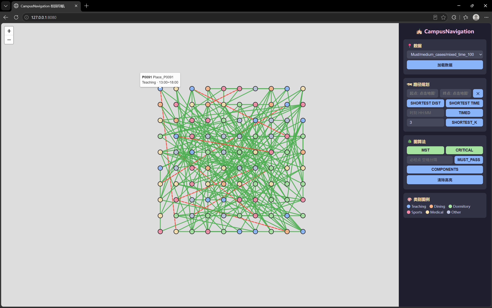

---

---

---

**最短路径 DIST / TIME**
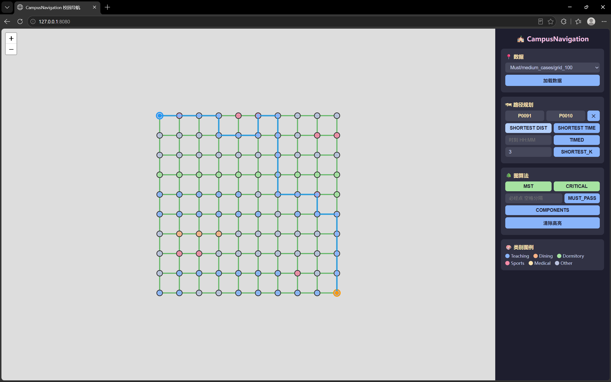
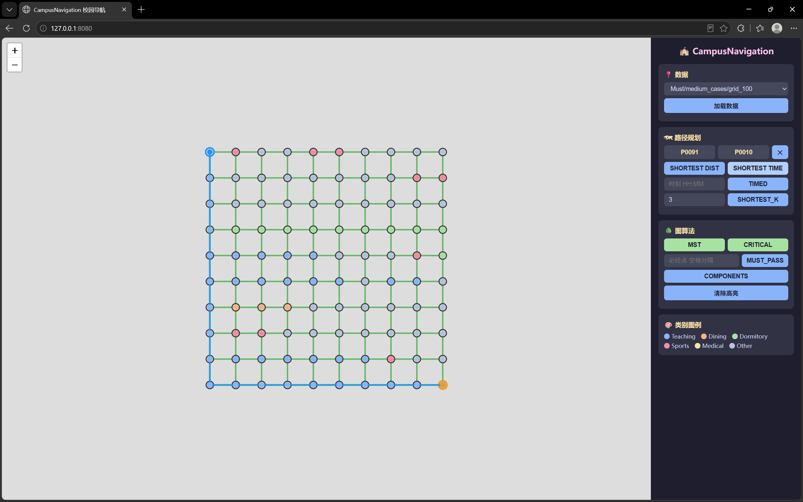

---

---

---

**必经点路径 MUST_PASS**
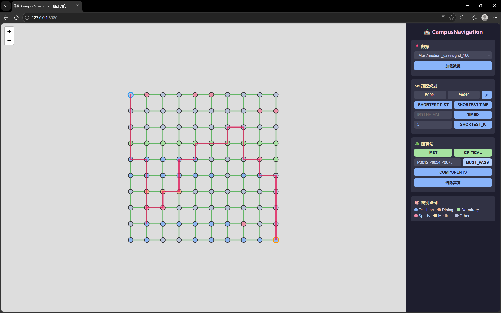

---

---

---

**共享单车 SHORTEST_K（K=1 / K=3 / K=5）**

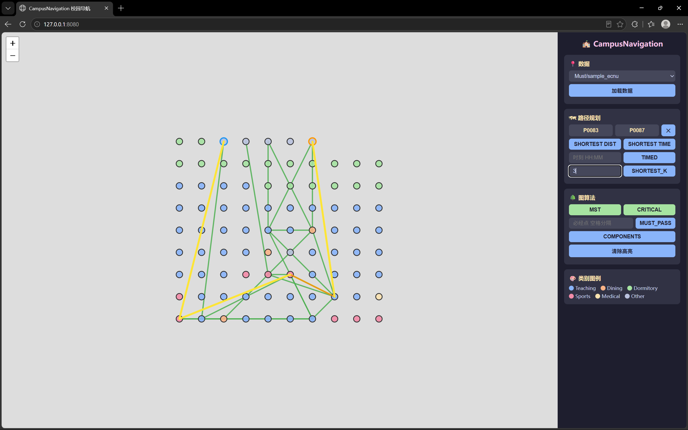


---

---

---

**关键节点与关键边**
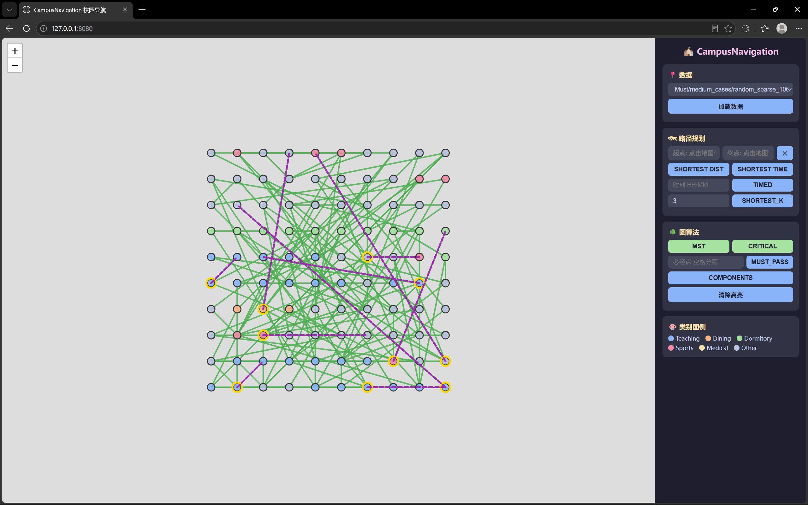

---

---

---

**MST 生成树（连通 / 不连通）**
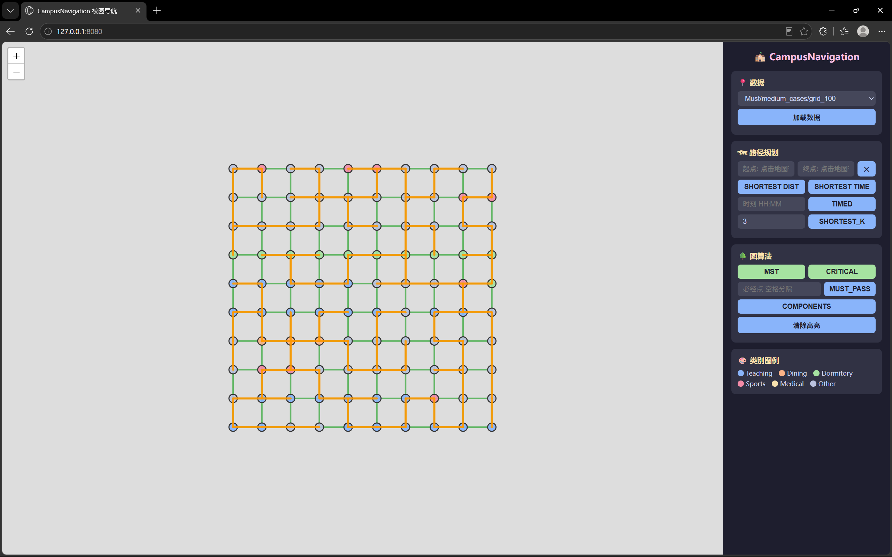
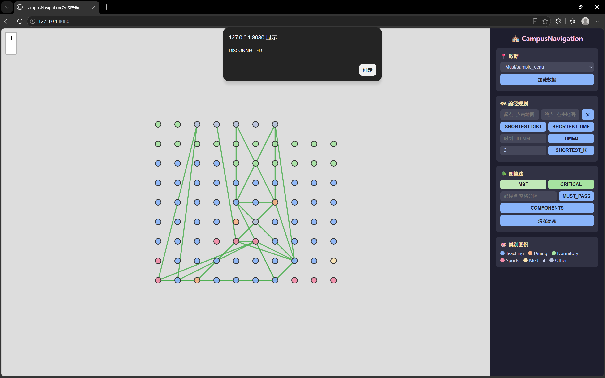

---

---

---

**非法数据拦截**
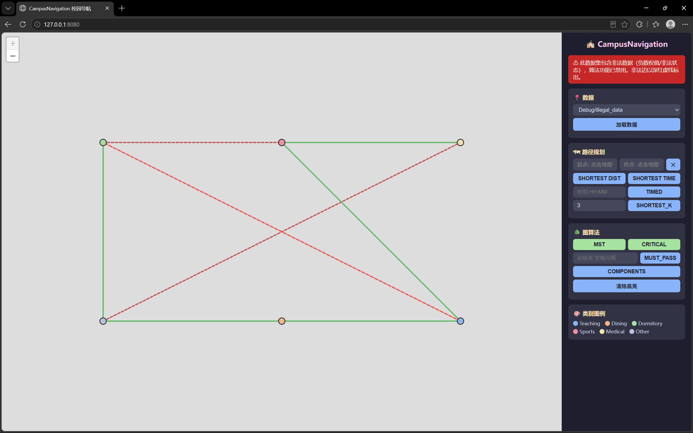

---

---

---

**连通分量分析**
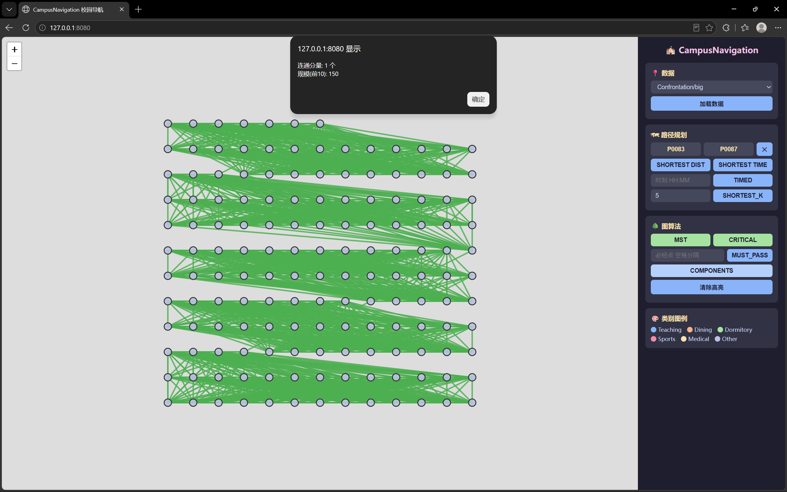

---

---

---

**关键边点压力测试（K1000 链）**
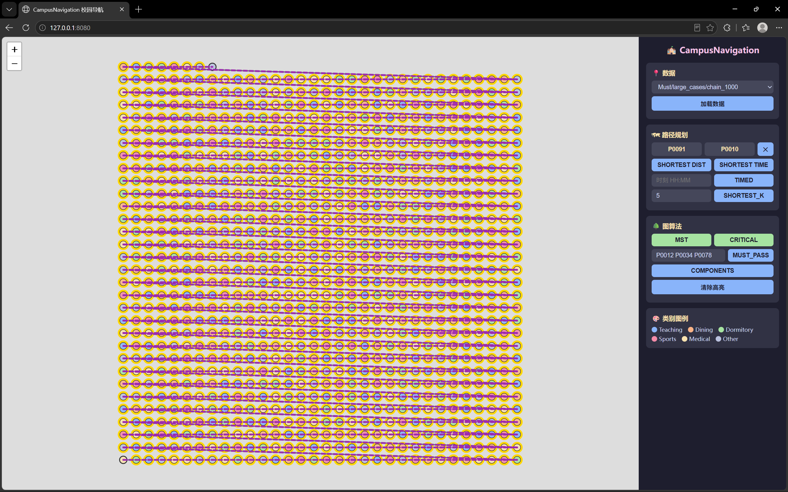

---

---

---

#### 演示视频

<video width="100%" controls>
  <source src="../web/resources/全示意(建议2倍速观看).mp4" type="video/mp4">
</video>


---

